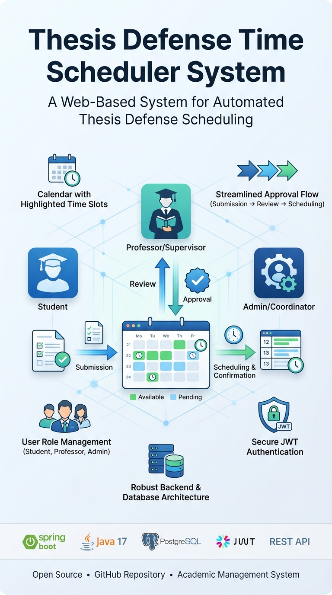

# Thesis Defense Time Scheduler System


The projects frontend can be found at [https://github.com/ghobadian/thesis_defense_time_schedular_frontend/]
A comprehensive web-based system for managing thesis defense scheduling in academic institutions. The system facilitates the entire workflow from thesis form submission to defense meeting scheduling, involving students, professors, and admins.

## Table of Contents
- [Overview](#overview)
- [Features](#features)
- [System Architecture](#system-architecture)
- [Models](#models)
- [Workflow](#workflow)
- [API Endpoints](#api-endpoints)
- [Security](#security)
- [Installation](#installation)
- [Configuration](#configuration)
- [Future Enhancements](#future-enhancements)

## Overview

This system automates and streamlines the thesis defense scheduling process for Bachelor, Master, and PhD students. It handles form submissions, approvals, jury assignments, and time slot coordination among multiple stakeholders to find the optimal defense time.

## Features

- **Multi-level Approval Workflow**: Instructor → Admin approval chain
- **Automated Time Slot Coordination**: Finds common availability among jury members
- **Role-Based Access Control (RBAC)**: Distinct permissions for Students, Professors, and Admins
- **JWT Authentication**: Secure stateless authentication with Access and Refresh tokens
- **Support for Multiple Academic Levels**: Bachelor, Master, and PhD programs
- **Department and Field Management**: Organized by academic departments and specific fields of study
- **System Statistics**: Dashboard data for administrators to track form statuses and meeting schedules
- **Comprehensive CRUD Operations**: Full management capabilities for students, departments, fields, and forms

## System Architecture

### Technology Stack
- **Backend**: Spring Boot 3+ (Java 17+)
- **Build Tool**: Maven
- **Database**:
  - **Development/Prod**: PostgreSQL
  - **Test**: H2 In-Memory Database
- **Migration**: Liquibase
- **Authentication**: JWT (JSON Web Tokens)
- **API**: RESTful API (base path: `/api/v1`)

### Diagrams
*See `src/main/resources/diagrams/` for Mermaid definitions (`classes.mmd`, `flowchart.mmd`).*

## Models

### Core Entities

#### User Hierarchy
- **User** (Abstract Base)
  - `Student` (Abstract): BachelorStudent, MasterStudent, PhDStudent
  - `Professor`: Can act as Instructor, Advisor, or Jury member
  - `Admin`: System administrators

#### Forms and Meetings
- **ThesisForm**: The central document created by students
- **ThesisDefenseMeeting**: Represents the actual scheduled defense event
- **TimeSlot**: Represents a specific time block of availability
- **Department**: Academic department organizational unit
- **Field**: Specific field of study within a department

### Key Relationships
- A `Student` creates a `ThesisForm`
- A `Professor` (Instructor) approves the form initially
- An `Admin` verifies administrative requirements and finalizes jury selection
- A `ThesisDefenseMeeting` is generated upon approval, triggering the scheduling phase

### Enums
- **Role**: `STUDENT`, `PROFESSOR`, `ADMIN`
- **FormStatus**: `DRAFT`, `SUBMITTED`, `INSTRUCTOR_APPROVED`, `ADMIN_APPROVED`, `REJECTED`
- **MeetingState**: `PENDING_JURY_AVAILABILITY`, `PENDING_STUDENT_SELECTION`, `SCHEDULED`, `CANCELLED`

## Workflow

### Defense Scheduling Process

1. **Form Creation**: Student logs in and submits a Thesis Form (Bachelor, Master, or PhD)
2. **Instructor Review**:
   - ✅ Approve: Form moves to Admin
   - ❌ Reject: Process ends (Status: `REJECTED`)
3. **Admin Review & Jury Assignment**:
   - ✅ Approve: Admin assigns jury members and creates meeting
   - ❌ Reject: Process ends
4. **Availability Collection**:
   - Professors (Jury members) provide their available time slots
   - State: `PENDING_JURY_AVAILABILITY`
5. **Time Slot Resolution**:
   - System calculates intersections of availability among all jury members
   - State moves to `PENDING_STUDENT_SELECTION`
6. **Student Selection**:
   - Student views the intersecting time slots
   - Student selects one slot
7. **Finalization**:
   - Professor schedules meeting with location
   - Meeting is confirmed (State: `SCHEDULED`)
8. **Completion**:
   - After defense, professor submits score (0-20 scale)

## API Endpoints

**Base URL**: `/api/v1`

### Authentication (`/auth`)
| Method | Endpoint | Description |
|:-------|:---------|:------------|
| POST | `/auth/login` | Authenticate and receive JWT tokens |
| POST | `/auth/refresh` | Rotate refresh tokens |

### Student (`/student`)
| Method | Endpoint | Description |
|:-------|:---------|:------------|
| GET | `/student/` | Get student profile |
| POST | `/student/create-form` | Submit a new thesis form |
| GET | `/student/forms` | List all thesis forms |
| GET | `/student/meetings` | List defense meetings |
| GET | `/student/meetings/{id}` | Get meeting details |
| GET | `/student/professors` | List available professors |
| POST | `/student/time-slots` | Select a defense time slot |
| PUT | `/student/change-password` | Change password |
| PUT | `/student/update-phone` | Update phone number |

### Professor (`/professor`)
| Method | Endpoint | Description |
|:-------|:---------|:------------|
| GET | `/professor/` | Get professor profile |
| GET | `/professor/list` | List all professors |
| GET | `/professor/timeslots` | Get own time slots |
| GET | `/professor/students` | Get supervised students |
| PUT | `/professor/update-phone` | Update phone number |
| PUT | `/professor/change-password` | Change password |

### Professor Forms (`/professor/forms`)
| Method | Endpoint | Description |
|:-------|:---------|:------------|
| GET | `/professor/forms` | List thesis forms for review |
| POST | `/professor/forms/{formId}/approve` | Approve a form |
| POST | `/professor/forms/reject` | Reject a form with reason |

### Professor Meetings (`/professor/meetings`)
| Method | Endpoint | Description |
|:-------|:---------|:------------|
| GET | `/professor/meetings` | List all meetings |
| GET | `/professor/meetings/{id}` | Get meeting details |
| POST | `/professor/meetings/give-time` | Submit available time slots |
| POST | `/professor/meetings/create` | Create meeting with jury |
| POST | `/professor/meetings/schedule` | Schedule meeting with location |
| POST | `/professor/meetings/score` | Submit defense score (0-20) |
| GET | `/professor/meetings/{meetingId}/timeslots` | Get all jury time slots & intersections |
| GET | `/professor/meetings/{meetingId}/my-timeslots` | Get own time slots for meeting |
| POST | `/professor/meetings/{meetingId}/cancel` | Cancel a meeting |

### Admin (`/admin`)
| Method | Endpoint | Description |
|:-------|:---------|:------------|
| GET | `/admin/` | Get admin profile |
| GET | `/admin/stats` | Get system statistics |
| GET | `/admin/professors` | List all professors |
| GET | `/admin/meetings` | List all meetings |
| GET | `/admin/meetings/{meetingId}` | Get meeting details |
| PUT | `/admin/update-phone` | Update phone number |
| PUT | `/admin/change-password` | Change password |

### Admin Students (`/admin/students`)
| Method | Endpoint | Description |
|:-------|:---------|:------------|
| GET | `/admin/students` | List students (with filters) |
| GET | `/admin/students/{studentId}` | Get student details |
| POST | `/admin/students` | Bulk register students |
| PUT | `/admin/students/{studentId}` | Update student |
| DELETE | `/admin/students/{studentId}` | Delete student |

**Query Parameters for GET `/admin/students`:**
- `search` - Search by name/email
- `departmentId` - Filter by department
- `page` - Page number
- `limit` - Results per page
- `studentType` - Filter by student type (BACHELOR/MASTER/PHD)

### Admin AdminDepartmentsPage (`/admin/departments`)
| Method | Endpoint | Description |
|:-------|:---------|:------------|
| GET | `/admin/departments` | List all departments |
| POST | `/admin/departments` | Create department |
| PUT | `/admin/departments/{departmentId}` | Update department |
| DELETE | `/admin/departments/{departmentId}` | Delete department |

### Admin Fields (`/admin/fields`)
| Method | Endpoint | Description |
|:-------|:---------|:------------|
| GET | `/admin/fields` | List all fields |
| POST | `/admin/fields` | Create field |
| PUT | `/admin/fields/{id}` | Update field |
| DELETE | `/admin/fields/{id}` | Delete field |

### Admin Forms (`/admin/forms`)
| Method | Endpoint | Description |
|:-------|:---------|:------------|
| GET | `/admin/forms` | List all forms |
| POST | `/admin/forms/{formId}/approve` | Approve a form |
| POST | `/admin/forms/reject` | Reject a form with reason |

## Security

### Authentication
- **Method**: JWT (Bearer Token)
- **Token Payload**: Includes Subject (Email), Role, and Expiration
- **Interceptor**: Custom `LoggingInterceptor` logs request method, URI, parameters, status, and duration

### Authorization
- **RBAC**: Role-based annotations ensure only specific roles access specific endpoints
- **Data Isolation**: Users can only view/edit their own data
- **Validation**: Jakarta Validation annotations on DTOs (`@Valid`, `@Min`, `@Max`)

## Installation

### Prerequisites
- Java 17 or higher
- Maven
- PostgreSQL (or Docker container)

### Steps

1. **Clone the repository**
   ```bash
   git clone [repository-url]
   cd thesis-defense-scheduler
   ```

2. **Configure Database**
   Update `src/main/resources/application.yaml` with your PostgreSQL credentials or use the default:
    - User: `postgres`
    - Password: `dev123`
    - DB: `myapp`

3. **Build the project**
   ```bash
   ./mvnw clean install
   ```

4. **Run the application**
   ```bash
   ./mvnw spring-boot:run
   ```

## Configuration

Configuration is managed in `src/main/resources/application.yaml`.

### Key Properties

| Property | Description | Default |
|:---------|:------------|:--------|
| `jwt.secret` | Secret key for signing tokens | *[Change in Prod]* |
| `jwt.expiration` | Token validity in ms | `86400000` (24h) |
| `spring.datasource.url` | Database URL | `jdbc:postgresql://...` |
| `rate-limit.max-submitted-forms` | Max active forms per student | `3` |
| `frontend.url` | CORS allowed origin | `http://localhost:3000` |

## Future Enhancements

1. **Rescheduling Logic**: Handle scenarios where no common time slots exist
2. **Notifications**: Email/SMS integration for status updates
3. **Calendar Integration**: Export scheduled defenses to Google Calendar/iCal
4. **Document Generation**: Auto-generate official PDF minutes for the defense meeting
5. **Manager Role**: Dedicated department manager endpoints for enhanced workflow

## Contributing

Pull requests are welcome. Please ensure tests pass before submitting.

## License

[MIT License](LICENSE) or as specified by the repository owner.

## Contact

You can find my contacts at my [site](https://kghobad.ir)
